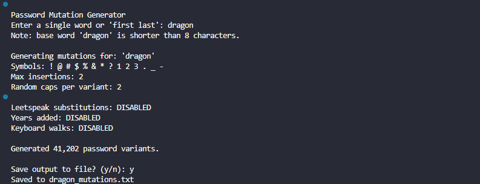

# 🔐 Passmu (Password Mutation Generator)

Passmu is a powerful password mutation tool for security and penetration testing.

---

## ✅ Features

- **First and last name**: concatenated, underscore, dot, hyphen, and reversed
- **Random capitalization**: randomly mixed uppercase and lowercase letters
- **Capitalization**: lowercase, uppercase, capitalized, and title case
- **Symbol and number**: before, after, and inside the word
- **Config**: YAML config file for easy customization
- **Leetspeak**: real-world leetspeak substitutions
- **On-the-fly compression**: save output to gzip
- **Output**: Save output to text file

## 🖵 Screenshot



## ⚙️ Config

```
max_lines_per_file: 10000000
random_caps_per_variant: 2
max_password_length: 24
min_password_length: 8
max_symbols: 2

use_short_years: true
use_long_years: false
use_years: true

use_keyboard_walks: false
use_compression: false
use_leetspeak: false

symbols: ['!', '@', '#', '$', '%', '&', '*', '?', '1', '2', '3', '.', '_', '-']
real_world_leet:
  a: ['@', '4']
  e: ['3']
  i: ['1', '!']
  o: ['0']
  s: ['$', '5']
  t: ['7']
  l: ['1']
  b: ['8'] 
  g: ['9']
  z: ['2']
keyboard_walks:
  - qwerty
  - asdfgh
  - zxcvbn
  - 123456
  - 654321
  - qazwsx
  - 1qaz2wsx
  - qweasd
  - poiuy
  - mnbvcx
years: 
  - "2025"
  - "2024"
  - "2023"
  - "2022"
  - "2021"
  - "2020"
  - "2019"
  - "2018"
  - "2017"
  - "2016"
  - "2015"
```
